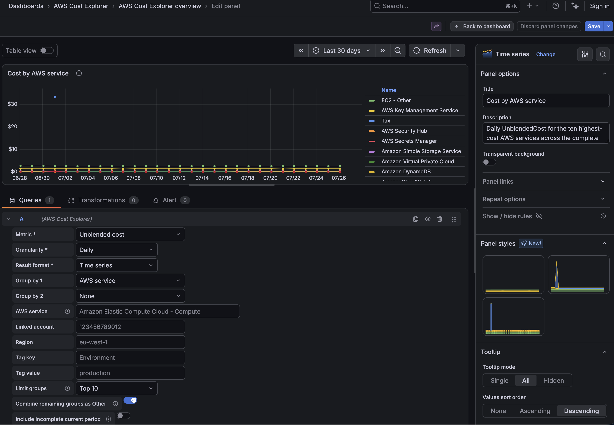
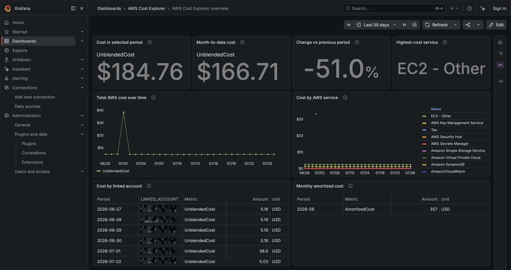
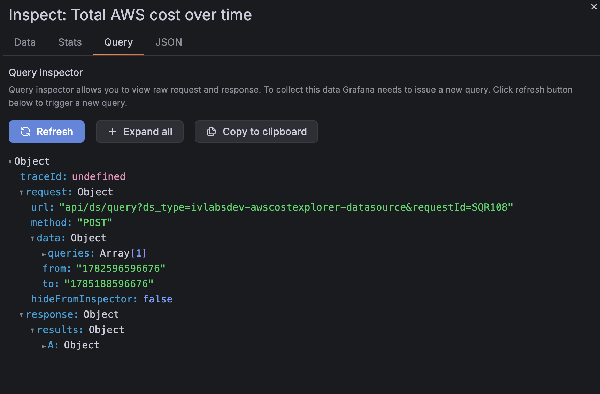

# AWS Cost Explorer for Grafana

> Query AWS Cost Explorer directly from Grafana in minutes, with a visual
> query builder and intelligent caching—without building a CUR/Athena pipeline
> or manually signing API requests.

AWS Cost Explorer for Grafana is an open-source backend data-source plugin for
self-hosted Grafana. It turns dashboard time ranges and visual query controls
into signed AWS Cost Explorer `GetCostAndUsage` requests, then returns native
Grafana time-series or table data frames.

The temporary plugin ID is `ivlabsdev-awscostexplorer-datasource`. The source
repository lives under the GitHub organization `ivlabs-dev`; Grafana's official
scaffolder normalizes that organization name to the ID prefix `ivlabsdev`.

This is an independent community project. It is not created, sponsored, or
endorsed by Amazon Web Services, Inc. or Grafana Labs. AWS and Amazon Web
Services are trademarks of Amazon.com, Inc. or its affiliates. Grafana is a
trademark of Grafana Labs.

## Status and features

The current MVP vertical slice includes:

- AWS SDK for Go v2 default credential chain
- AssumeRole with optional external ID and role session name
- static credentials stored only in Grafana secure JSON data
- `CheckHealth` credential resolution and a minimal Cost Explorer request
- visual metric, daily/monthly granularity, grouping, filtering, and format
  controls
- all requested MVP metrics and up to two grouping dimensions
- AWS service, linked account, region, and cost allocation tag filters
- paginated `GetCostAndUsage` execution
- grouped and ungrouped Grafana time-series frames
- incomplete daily/monthly period exclusion by default, with an explicit opt-in
- calendar-aligned monthly queries by default
- clean grouped series names with original AWS dimensions preserved as labels
- Top 5, Top 10, or Top 20 ranking across the complete range, with optional
  per-period `Other` aggregation
- table frames with sortable billing-period strings, dimensions, metric,
  amount, and unit
- bounded in-memory TTL/LRU caching and concurrent request deduplication
- Query Inspector metadata and structured logs for freshness, cache, AWS
  duration, pagination, incomplete periods, and estimated results
- a provisioned data source and eight-panel example dashboard, including four
  summary KPIs
- mocked Go tests and Jest frontend tests that require no AWS account

## Screenshots

The following screenshots use development data; credentials are not included,
and visible account-like values are development placeholders.

- Data-source authentication and cache configuration: _placeholder_
- Visual Cost Explorer query editor:
  
- Example FinOps dashboard with summary KPIs:
  
- Query Inspector cache and freshness metadata:
  

## Requirements

- Grafana 12.3 or later
- Node.js 22 or 24 for frontend development
- npm 11
- Go 1.26.5, as selected by the current Grafana scaffold
- Mage for backend builds
- Docker and Docker Compose for the local Grafana environment
- an AWS identity with `ce:GetCostAndUsage`
- Cost Explorer enabled in the AWS payer/management account being queried

The Go command can automatically download the toolchain declared in `go.mod`
when `GOTOOLCHAIN=auto` is enabled.

## Quick start

Install dependencies and build both halves of the plugin:

```bash
npm ci
npm run build
mage -v
```

Start the standard local Grafana environment:

```bash
docker compose up --build
```

Open <http://localhost:3000>, sign in as the development administrator, open
**Connections > Data sources > AWS Cost Explorer**, and select **Save & test**.
The development container explicitly allows this unsigned plugin. Restart
Grafana after changing `src/plugin.json`.

The provisioned data source uses the default AWS credential chain. Export AWS
environment variables before starting Compose, or extend the local Compose
service with a read-only shared AWS configuration mount. Do not commit those
values or files.

## Installation

For a development install, use the provided Compose environment. For a manual
Grafana install:

1. Build or download an artifact for the Grafana server architecture.
2. Extract its top-level `ivlabsdev-awscostexplorer-datasource` directory into
   Grafana's plugin directory.
3. Ensure the `gpx_*` backend binary is executable.
4. Install a properly signed release, or explicitly allow the plugin ID only in
   a non-production development Grafana configuration.
5. Restart Grafana.

Grafana's official packaging flow is:

```bash
npm run build
mage -v
mv dist ivlabsdev-awscostexplorer-datasource
zip -r ivlabsdev-awscostexplorer-datasource-1.0.0.zip \
  ivlabsdev-awscostexplorer-datasource
```

Use a temporary copy of `dist` when packaging locally so the development mount
is not renamed. Signing requires a Grafana access-policy token:

```bash
GRAFANA_ACCESS_POLICY_TOKEN=... npm run sign
```

No signing credential is required by ordinary CI or unit tests.

## Data-source configuration

### Default credential chain

This is the recommended mode. AWS SDK for Go v2 can resolve:

- `AWS_ACCESS_KEY_ID`, `AWS_SECRET_ACCESS_KEY`, and optional
  `AWS_SESSION_TOKEN`
- web identity (`AWS_ROLE_ARN` and `AWS_WEB_IDENTITY_TOKEN_FILE`)
- shared AWS credentials and configuration files
- ECS task role credentials
- EC2 instance role credentials
- other identity providers supported by the SDK's default configuration chain

Set the AWS region used for endpoint selection and signing. `us-east-1` is the
default.

### AssumeRole

Choose **Assume an IAM role**, then configure:

- the full target IAM role ARN
- an optional external ID
- an optional role session name
- the AWS region

The plugin resolves source credentials through the default chain and uses STS
to assume the target role. The source identity needs permission for
`sts:AssumeRole`, and the target role trust policy must trust that source. The
target role needs the Cost Explorer policy below.

The external ID is treated as a secret and stored in secure JSON data even
though AWS does not define it as a password.

### Kubernetes IRSA

Run Grafana with a Kubernetes service account mapped to an IAM role. On Amazon
EKS, the service account commonly has an annotation similar to:

```yaml
apiVersion: v1
kind: ServiceAccount
metadata:
  name: grafana
  annotations:
    eks.amazonaws.com/role-arn: arn:aws:iam::123456789012:role/GrafanaCostExplorer
```

Set the Grafana pod's `serviceAccountName: grafana` and use **Default credential
chain** in the data source. The EKS admission path supplies the web identity
token and AWS environment variables to the Grafana pod; the backend SDK reads
them and rotates temporary credentials. For cross-account access, use this role
as the source for the plugin's AssumeRole mode.

### Static credentials

Static credentials are a fallback for environments without workload identity.
The UI requires an access key ID and secret access key and accepts an optional
session token. Prefer short-lived role credentials: long-lived keys are harder
to rotate, easier to leak, and broaden incident response scope.

All static credential values are written to Grafana `secureJsonData`. Grafana
encrypts them at rest and returns only configured/not-configured flags to the
browser after saving. The backend receives decrypted values only when Grafana
creates the data-source instance. They are never logged or placed in query
models or cache keys.

## IAM policy

The target AWS identity needs only this MVP action:

```json
{
  "Version": "2012-10-17",
  "Statement": [
    {
      "Sid": "ReadCostExplorer",
      "Effect": "Allow",
      "Action": "ce:GetCostAndUsage",
      "Resource": "*"
    }
  ]
}
```

Cost Explorer does not provide a resource ARN for this operation, so
`Resource` must be `"*"`. The plugin does not need or request AWS write access.
AssumeRole source identities additionally require `sts:AssumeRole` for the
specific target role; that permission belongs in the source policy, not this
target role policy.

The same policy is available at
[`docs/iam-policy.json`](docs/iam-policy.json).

## Query examples

The query editor uses the Grafana dashboard range automatically.

- Total daily cost: **Unblended cost**, **Daily**, no grouping, **Time series**
- Daily cost by service: **Unblended cost**, **Daily**, group by **AWS
  service**, **Top 10**, combine remaining groups as **Other**, **Time series**
- Account/service matrix: group first by **Linked account**, then by **AWS
  service**, **Table**
- Monthly effective cost: **Amortized cost**, **Monthly**, no grouping,
  **Align to complete calendar months**, **Table**
- Tagged workload: set tag key `Environment` and tag value `production`

Cost Explorer's end date is exclusive. The backend preserves a dashboard end
at exact UTC midnight and rounds any other end timestamp to the next UTC date.

`UsageQuantity` can combine unrelated units such as hours and gigabytes.
Filter to a meaningful service or usage type before using it.

### Period and presentation semantics

AWS may revise the current day or month while billing data is still arriving.
The plugin therefore excludes the current UTC billing period by default:

- daily queries stop before the current UTC calendar day
- monthly queries stop before the current UTC calendar month
- a range containing no completed periods returns an empty, valid frame with a
  notice and makes no AWS request

Select **Include incomplete current period** when intentionally viewing
month-to-date or current-day data. The frame metadata then records that the
response may contain an incomplete period. This option affects only the Cost
Explorer query; it does not alter the dashboard time range.

Monthly queries select **Align to complete calendar months** by default. The
start is normalized to the first day of its month, and the exclusive end uses
a calendar-month boundary. Disabling alignment preserves the range-derived
behavior and can return a partial first or last month.

Table periods are sortable strings: `YYYY-MM-DD` for daily data and `YYYY-MM`
for monthly data. Time-series values remain Grafana timestamps at the beginning
of the AWS billing period in UTC; the plugin never applies a browser-local
offset.

Grouped time-series display names contain values only, such as `Amazon EC2` or
`Amazon EC2 · Production`. Dimension names and values remain available as
Grafana field labels. Top N ranking uses each group's decimal-safe total across
the complete returned range. When enabled, `Other` sums the excluded groups
separately for every period and never combines incompatible units.

### Example dashboard KPIs

The provisioned dashboard places four stat panels above the detailed charts:

- **Cost in selected period** sums ungrouped `UnblendedCost`.
- **Month-to-date cost** intentionally includes the incomplete current period
  and notes AWS reporting delay.
- **Change vs previous period** compares the selected range with the immediately
  preceding equivalent-duration range. Positive and negative changes are
  presented neutrally; a zero previous total returns no percentage.
- **Highest-cost service** ranks services over the selected range and displays
  the leading service name without a `SERVICE=` prefix.

## Caching behavior

Cost Explorer API requests can incur AWS charges. Caching is therefore part of
the query path:

- default TTL: 900 seconds
- default capacity: 256 entries per configured Grafana data source
- bounded LRU eviction
- failures are never cached
- identical concurrent misses share one AWS request
- cache entries are local to one backend process and are not shared by Grafana
  replicas

Keys are SHA-256 digests of safe credential context and the canonical request:
role ARN, authentication mode, region, time period, granularity, metric,
groupings, and filters. Secrets are excluded. Filter and tag values influence
the digest but are not emitted in logs. Presentation-only choices such as table
versus time series, Top N, and `Other` reuse the same cached AWS response.

Every returned frame carries a `costExplorer` custom metadata object. Grafana's
Query Inspector can show:

- query execution timestamp, total backend duration, and AWS API duration
- cache status (`hit`, `miss`, or `bypass`), hit age, and configured TTL
- AWS page count
- whether an incomplete billing period was included
- whether AWS marked any returned period as estimated

Cache hits report zero AWS duration and zero pages because no AWS call was made
for that execution. Metadata never contains credentials, external IDs, cache
keys, request filters, or tag values.

## What the plugin sends to AWS

The backend sends signed HTTPS `GetCostAndUsage` requests containing the
selected period, metric, granularity, group definitions, optional filters, and
pagination token. AssumeRole mode also sends the configured role ARN, session
name, and optional external ID to AWS STS. It sends no Grafana user data,
dashboard titles, panel titles, analytics, or tracking events.

## Development commands

```bash
# Install locked frontend dependencies
npm ci

# Frontend watch/production builds
npm run dev
npm run build

# Frontend checks
npm run typecheck
npm run lint
npm run test:ci

# Backend formatting check, analysis, tests, and builds
test -z "$(gofmt -l ./pkg)"
go vet ./pkg/...
go test ./pkg/...
mage -v

# Local Grafana
docker compose up --build

# Playwright smoke tests (Grafana must be running)
npm exec playwright install chromium
npm run e2e
```

The real AWS Playwright health test is disabled by default:

```bash
AWS_INTEGRATION_TEST=1 npm run e2e
```

Only opt in with disposable/role credentials and the least-privilege policy.

## Repository layout

```text
pkg/awsclient       AWS SDK v2 client and credential factory
pkg/cache           bounded TTL/LRU cache and request deduplication
pkg/costexplorer    request construction, pagination, and error mapping
pkg/frames          Grafana data-frame conversion
pkg/models          settings, secrets, query model, and validation
pkg/plugin          Grafana lifecycle, QueryData, CheckHealth, and logs
src/components      React configuration and query editors
provisioning        local data source and example dashboard
docs                implementation plan, architecture, and IAM policy
tests               opt-in/local Playwright smoke tests
```

See [`docs/architecture.md`](docs/architecture.md) and
[`docs/implementation-plan.md`](docs/implementation-plan.md).

## Troubleshooting

**No AWS credentials were found**

Verify the credentials are available inside the Grafana server/pod, not only
in your browser or workstation shell. For IRSA, inspect the Grafana pod's
service account, token mount, `AWS_ROLE_ARN`, and
`AWS_WEB_IDENTITY_TOKEN_FILE`.

**AWS denied the request**

Grant `ce:GetCostAndUsage` to the final identity. In AssumeRole mode, also
verify the source `sts:AssumeRole` policy, target trust policy, external ID, and
role ARN.

**The query is empty**

Cost Explorer must be enabled, billing data can lag, and filters require exact
Cost Explorer dimension values. Widen the dashboard range and remove filters
to isolate the issue.

**The latest day is missing**

This is the safe default. Daily queries exclude the current UTC calendar day
because AWS can still revise it. Enable **Include incomplete current period**
when the partial value is useful.

**The latest month is missing**

Monthly queries exclude the current calendar month by default. Enable
**Include incomplete current period** for month-to-date reporting. The example
month-to-date KPI already does this intentionally.

**Why does the current month not match my AWS console yet?**

Cost Explorer is not real-time, its results may be estimated, and AWS can revise
recent periods. The plugin also uses a bounded cache. Check
`costExplorer.containsEstimatedData`, `cacheStatus`, `cacheAgeSeconds`, and
`queryExecutedAt` in Query Inspector before comparing snapshots.

**Why does the dashboard show cached data?**

The default cache TTL is 15 minutes to avoid unnecessary paid Cost Explorer API
calls. Query Inspector reports the cache status, age, and TTL. Save a shorter
TTL in data-source settings when the additional AWS calls are acceptable;
restarting the backend process also clears this in-memory cache.

**Why are only the top services displayed?**

The example service chart uses Top 10 across the complete selected range and
combines the remainder into `Other` per period. Choose **All** in **Limit
groups**, select a larger limit, or disable **Combine remaining groups as
Other** for a different presentation.

**The plugin is not visible**

Confirm the extracted directory and `plugin.json` both use
`ivlabsdev-awscostexplorer-datasource`, the backend binary is executable, the
plugin is signed or explicitly allowed for development, and Grafana was
restarted after metadata changes.

## Security considerations

- Prefer workload or IAM roles and short-lived credentials.
- Give the final identity only `ce:GetCostAndUsage`.
- Restrict `sts:AssumeRole` to the intended target role.
- Treat Grafana administrators and the Grafana host as privileged because the
  backend receives decrypted secure settings.
- Do not enable debug logging from the AWS SDK with request bodies or signed
  headers in production.
- Protect cost data as potentially sensitive business information.
- Review provisioning files before publishing them; never commit credentials.

The plugin logs safe operational metadata only. It does not log credential
objects, keys, session tokens, full AWS requests, signed headers, or filter/tag
values.

## Current limitations

- in-memory cache only; replicas do not share cache state
- exact text filter entry rather than AWS dimension-value discovery
- no hourly granularity
- no cost category grouping or UI
- highest-cost service uses the service name as its primary stat; portable
  Grafana stat configuration does not also render the cost as secondary text
- no CUR, Athena, forecasts, budgets, anomalies, commitments, or Organizations
  discovery
- no hosted service, reports, notifications, billing, subscriptions, or user
  analytics
- no signed catalog release yet

## Roadmap

Near-term priorities are AWS dimension-value autocomplete, stronger dashboard
and plugin-e2e coverage, and catalog signing/release automation. Later
open-source extensions may add forecasts, cost categories, and optional
distributed caching. CUR/Athena and any managed FinOps service will be designed
as separate capabilities so they do not complicate the direct Cost Explorer
experience.

## Contributing

Issues and pull requests are welcome at
<https://github.com/ivlabs-dev/grafana-aws-cost-explorer-datasource>. Keep
changes focused, add tests for behavior, run the frontend and Go checks above,
and never include real AWS account details or credentials in fixtures.

## License

Licensed under the [Apache License 2.0](LICENSE). It provides a permissive
open-source basis with an explicit patent grant and is commonly understood in
the Grafana and cloud tooling ecosystems.
